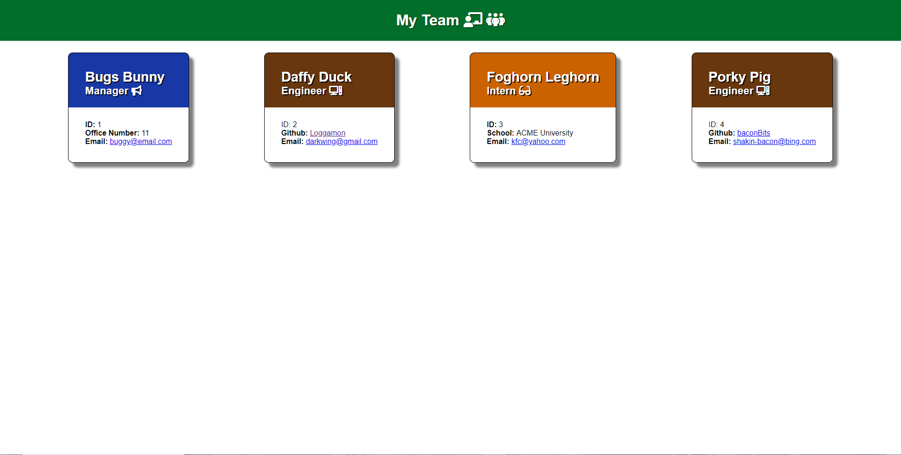
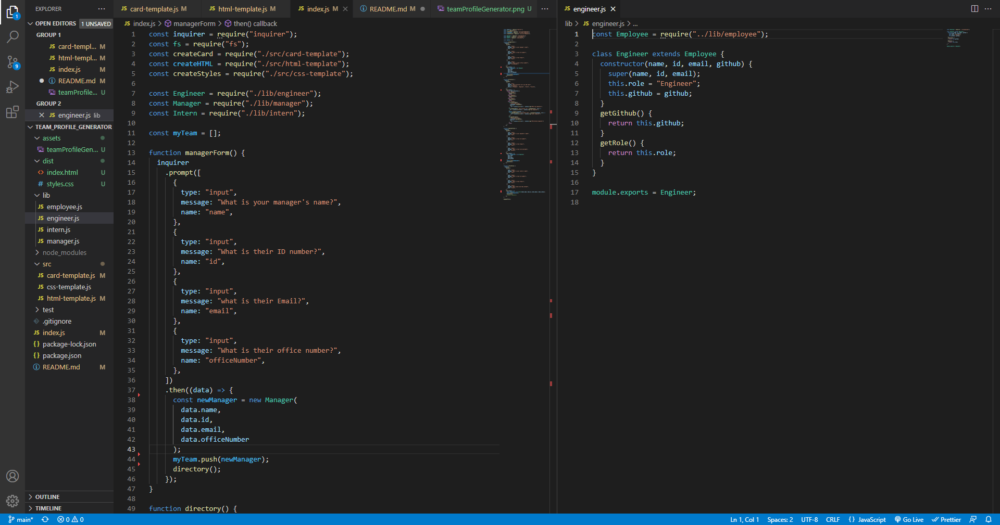

# Team Profile Generator



## The Breakdown

For this week, we are tasked with creating a node-based questionnaire that takes in user-input, and outputs it into an HTML template. Upon completion of the questionnaire, an HTML file, as well as a CSS file, is generated with the user's input data.
This HTML will display a series of cards, each containing specialized criteria depending on the person's job status.

Lets breakdown the Acceptance Criteria:

```
WHEN I am prompted for my team members and their information
THEN an HTML file is generated that displays a nicely formatted team roster based on user input
```

- This is saying that a newly generated HTML file is contingent on the data that the user inputs; it wil not generate otherwise.

```
WHEN I click on an email address in the HTML
THEN my default email program opens and populates the TO field of the email with the address
```

- This says that a hyperlink is needed for our email, so that they can easily message them through mail.

```
WHEN I click on the GitHub username
THEN that GitHub profile opens in a new tab
```

- This will also be a hyperlink; this time for their github web profile.

```
WHEN I start the application
THEN I am prompted to enter the team manager’s name, employee ID, email address, and office number
```

- This explains the process of the questionnaire; saying that the users input will pertain to their team's information.

```
WHEN I enter the team manager’s name, employee ID, email address, and office number
THEN I am presented with a menu with the option to add an engineer or an intern or to finish building my team
```

- This explains hot the directory part of the function works; it will let you choose another position to add, instantiating that desired function.

```
WHEN I select the engineer option
THEN I am prompted to enter the engineer’s name, ID, email, and GitHub username, and I am taken back to the menu
```

- This says what questions they want the program to ask for engineers.

```
WHEN I select the intern option
THEN I am prompted to enter the intern’s name, ID, email, and school, and I am taken back to the menu
```

- This says what questions they want the program to ask for interns.

```
WHEN I decide to finish building my team
THEN I exit the application, and the HTML is generated
```

- Upon finishing the program, a new HTML and CSS file should be created, including the information the user added.



## Daily Progress

### Day One

- Organized my files an folders so I can get file paths nailed down.
- Downloaded 'inquirer' and 'jest'; 'inquirer will handle my questionnaire, while 'jest' will test my js codes.

### Day Two

- Wrote out my different Profession js files, as well as their test js files.
- Ran tests on the position js files; they all succeeded.
- Started figuring out layout for HTML/CSS files.
- Typed up README file for project.

### Day Three

- Worked on template for HTML, CSS, and Profession Cards.

### Day Four

- Have successfully completed all the js functions, ensuring that they work!
- Deleted unecessary/redundant files in my project.
- Have also finished video-demonstration; will include at the bottom of the README.

## VIdeo DEMO

- [Here is the link to the video demonstration!](videolink here!)
